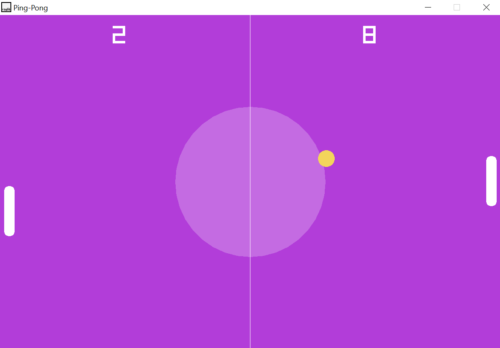
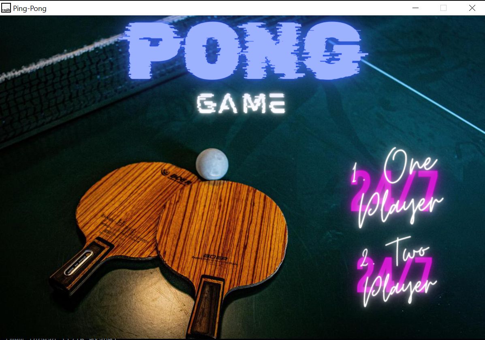
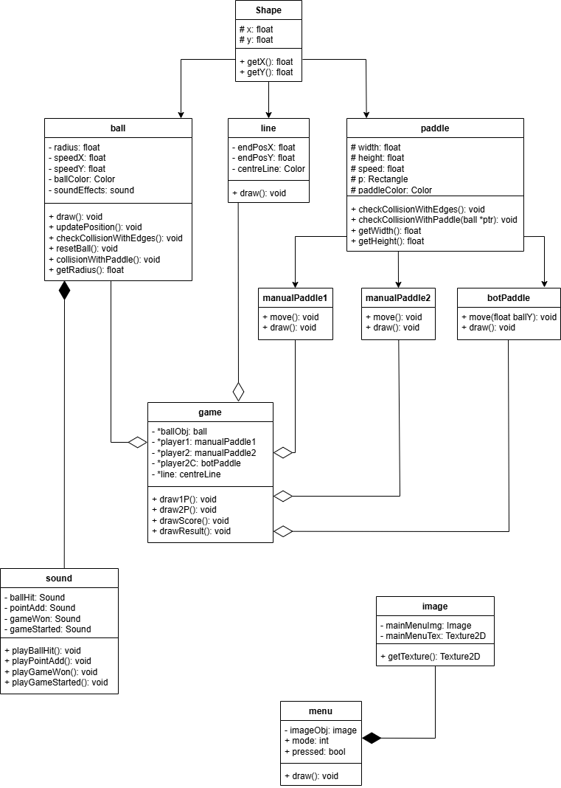
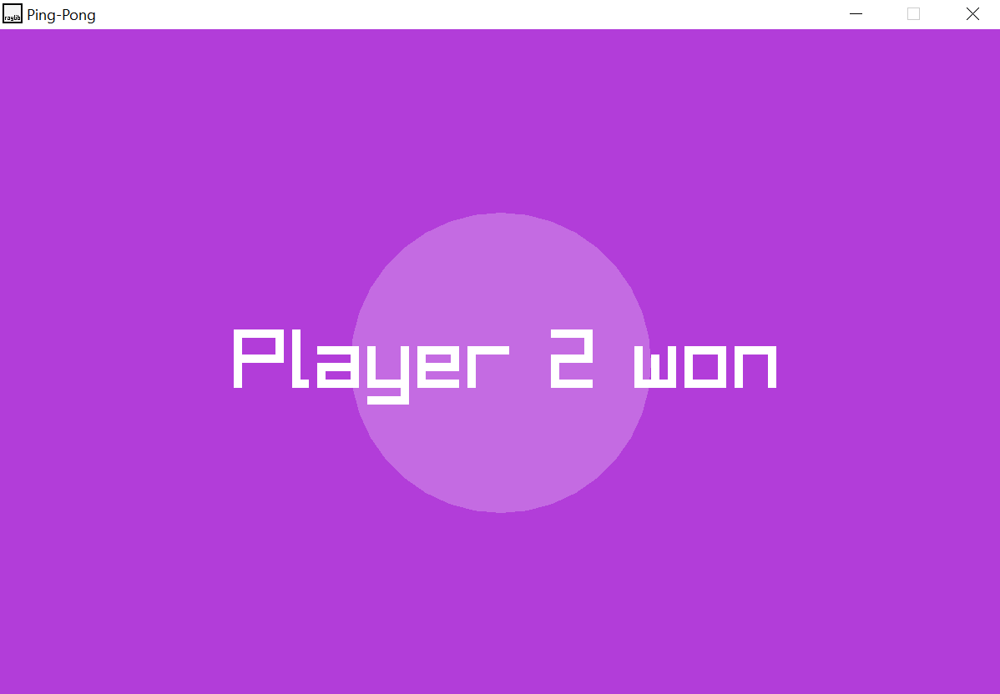

# Pong Game in C++

## Gameplay Screenshot

Here is the source code of a pong game made in c++ using raylib library. There are two modes in the game:

1. One player (human vs cpu)
2. Two player (human vs human)

## MainMenu Screenshot

This game has a main menu for selecting the mode and has sound effects included to make the game more realistic and fun.

## Controls

1. One player: w for up, s for down
2. Two player: same as above, just arrow keys for second player

## OOP:

This game in made using oop concepts and below is the uml class diagram of it:

## Result:

After scoring 10 goals, the player wins and match ends.

## Run It:

To run this source code, you need raylib library from their website.
[Raylib download](https://www.raylib.com/)

